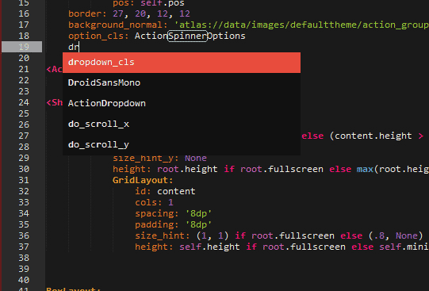
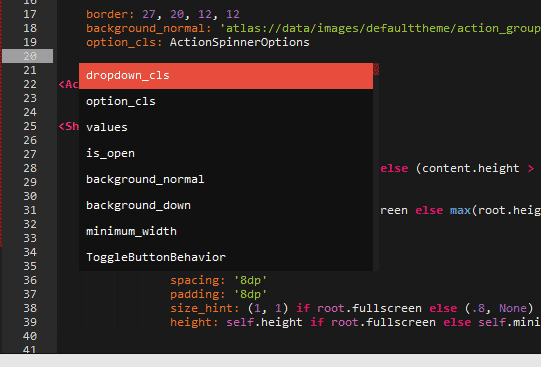
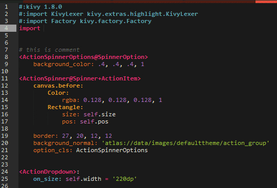
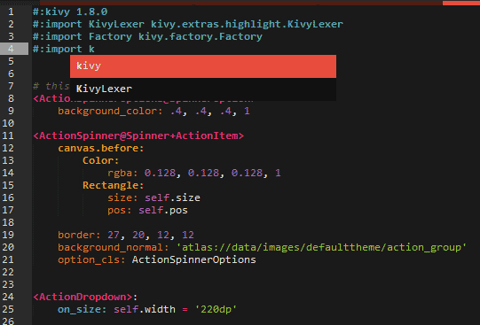
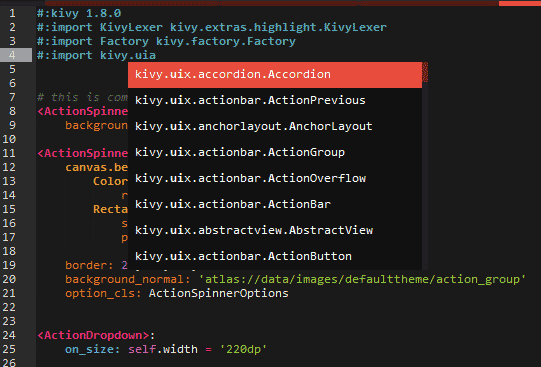
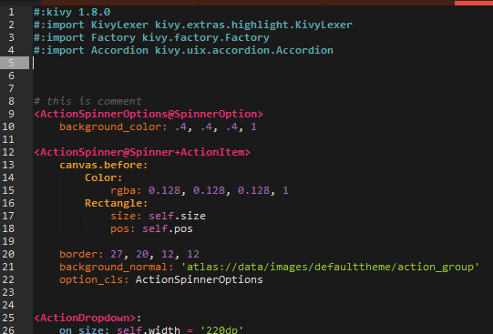

## Summary
Kivy lang syntax highligh and autocompletion.


## How to Use

* for widget/class scope auto-completetion.
    - enter code under widget scope
         
        
    - enter ctrl+space to trigger code hint
        

        
* for kivylang import auto-completetion.
     
     
     
     


### Configure setting
Theoretically, no configuration is needed.( I'm not quite familiar with sublime configuration, so just raise an issue if you have problem running this plugin)
In case your hightlight did not work!

```json
{
    "auto_complete_triggers":
    [
        {
            "characters": "qazwsxedcrfvtgbyhnujmikolpQAZWSXEDCRFVTGBYHNUJMIKOLP.\n ",
            "selector": "source.python.kivy"
        }
    ],
    "color_scheme": "Packages/KivyLang/KivyLang.tmTheme",
    "font_size": 9,
    "theme": "KivyLang.sublime-theme",
    "kivy_path": "",            //not implement yet
    "template_runner": "",      //not implement yet
    "ps_path": ""               //not implement yet
}

```


### Install
* for windows:
    copy all the files into C:\Users\{user_name}\AppData\Roaming\Sublime Text 3\Packages\KivyLang

* for linux:

* for mac: